# Serverless Cloud Resume Platform

## 🌐 Live Demo

**👉 [https://d3qdhuc3vdryzz.cloudfront.net/](https://d3qdhuc3vdryzz.cloudfront.net/)**

---

## 📌 Overview

This project implements a fully serverless resume platform hosted on AWS.

It demonstrates:

- **Secure static hosting**
- **Serverless REST API design**
- **Real-time visitor counter**
- **IAM least-privilege configuration**
- **Debugging of 403 & permission boundary issues**
- **CI/CD automation using GitHub Actions**

The system is designed to be **scalable**, **secure**, and **cost-efficient**.

---

## 🏗️ Architecture



**High-Level Flow**

```
User → CloudFront → Private S3
                      ↓
                Frontend (JS)
                      ↓
                API Gateway
                      ↓
                   Lambda
                      ↓
                  DynamoDB
```

---

## 🔐 Security Implementation

- **S3 Block Public Access** enabled
- **CloudFront Origin Access Control (OAC)**
- **IAM least-privilege policies**
- **Lambda execution role isolation**
- **CORS properly configured**
- **Region alignment** across all services

---

## 🧠 Technical Challenges Solved

### 🔹 IAM Permission Boundary Issues

Diagnosed restrictive IAM boundaries that prevented Lambda execution and resolved trust policy conflicts.

### 🔹 403 AccessDenied Errors

Resolved authorization issues across:

- S3 bucket policy
- CloudFront distribution
- API Gateway permissions

### 🔹 DynamoDB Decimal Serialization

Handled Python `Decimal` types to ensure valid JSON API responses.

### 🔹 Atomic Counter Updates

Implemented DynamoDB `UpdateExpression` to prevent race conditions during concurrent requests.

---

## ⚙️ Tech Stack

- **AWS S3**
- **AWS CloudFront**
- **AWS API Gateway (HTTP API)**
- **AWS Lambda (Python)**
- **AWS DynamoDB**
- **AWS IAM**
- **GitHub Actions (CI/CD)**
- **Python**

---

## 🚀 CI/CD Pipeline

Automated deployment workflow:

- **Triggered on push to `main`**
- **Syncs frontend files to S3**
- **Packages and updates Lambda**
- **Invalidates CloudFront cache**
- **Zero manual console deployment**

**Workflow location:** `.github/workflows/deploy.yml`

---

## 🛠️ Local Development Setup

### 1️⃣ Clone Repository

```bash
git clone https://github.com/xouvik09/cloud-resume-challenge.git
cd cloud-resume-challenge
```

### 2️⃣ Configure AWS Credentials

```bash
aws configure
```

Enter:

- **AWS Access Key ID**
- **AWS Secret Access Key**
- **Region** (must match deployment region)
- **Default output format:** `json`

⚠️ **Never commit credentials to the repository.**

### 3️⃣ Test Lambda Locally

```bash
cd backend
pip install -r requirements.txt
python lambda_function.py
```

(Optional: Use AWS SAM or Docker for advanced local testing.)

### 4️⃣ Deploy via CI/CD

Push to `main` branch:

```bash
git add .
git commit -m "Deploy update"
git push origin main
```

GitHub Actions handles deployment automatically.

---

## 📈 What This Project Demonstrates

- **Serverless architecture design**
- **IAM debugging capability**
- **Secure cloud deployment**
- **REST API integration**
- **DynamoDB atomic operations**
- **Full-stack CI/CD automation**
- **Production-level troubleshooting**

---

## 🔮 Future Improvements

- **Infrastructure as Code** (Terraform / CloudFormation)
- **CloudWatch dashboards & monitoring**
- **AWS WAF integration**
- **Custom domain with ACM SSL**
- **Automated testing for Lambda**

---

## 👨‍💻 Author

**Souvik Ghosh**  
Computer Science Undergraduate (2021–2025)  
Aspiring Backend & Cloud Engineer
